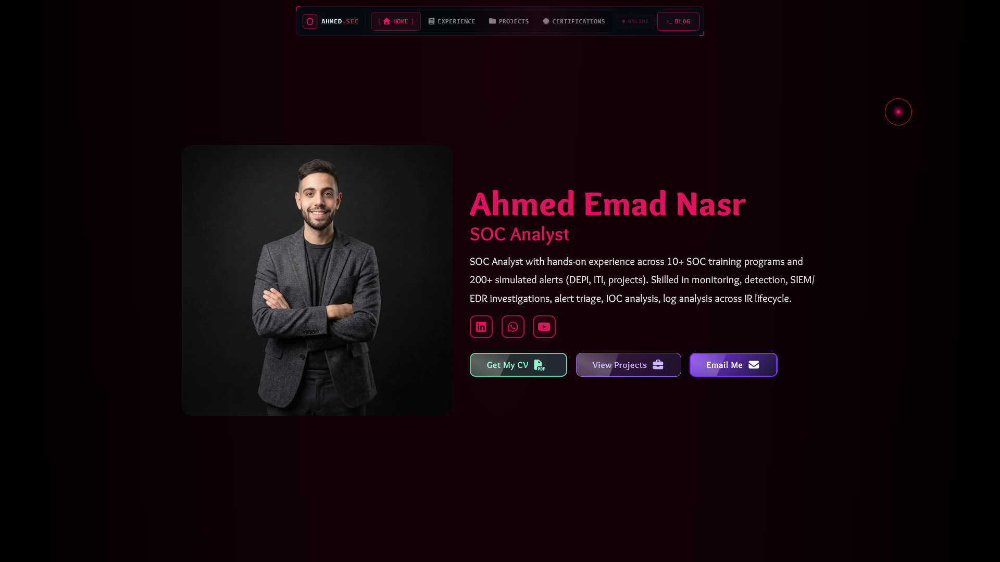
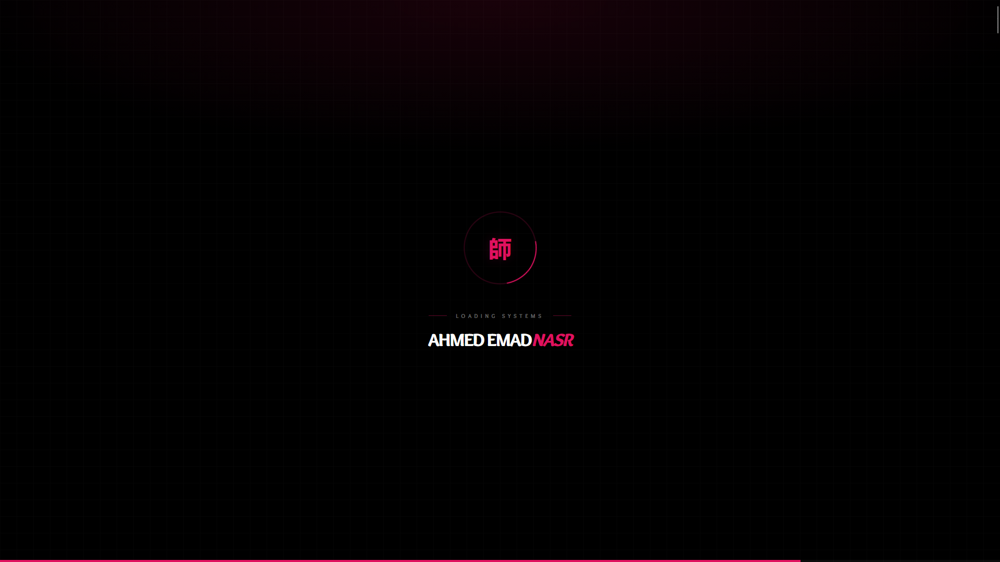

# Ahmed Emad Nasr Portfolio
<h1 align="center">Sensei-Dev Portfolio</h1>
<p align="center"></p>
<p align="center">
  <strong>Explore a world of innovative Software Development and creative problem-solving.</strong>
</p>
<p align="center">
  <a href="#about">About</a> •
  <a href="#features">Features</a> •
  <a href="#demo">Demo</a> •
  <a href="#installation">Installation</a> •
  <a href="#technologies">Technologies</a> •
  <a href="#contributing">Contributing</a> •
  <a href="#license">License</a>
</p>

---

## About

Welcome to Ahmed Emad Nasr, My Personal portfolio and cybersecurity blog built with Next.js, focused on SOC work, incident response, DFIR writeups, training material, and project evidence.
## Features

🌟 Here are some of the standout features of this portfolio:

1. **Stunning Visual Design**:

   - Visually appealing interface with smooth animations
   - Cohesive color scheme creating a harmonious browsing experience

2. **Fully Responsive Layout**:

   - Seamless experience across all devices - from mobile phones to desktop computers

3. **Interactive Project Showcase**:

   - Explore a diverse range of projects
   - Detailed descriptions and live demos where available

4. **Image Processing**:

   - Dynamic image gallery automatically optimized for performance
   - Custom Python script for converting and adjusting images for web
   - Image compression at various levels
   - Extraction of images from a specified path

5. **Interactive Landing Section**:

   - Attractive and modern design with interactive animations

6. **Specialized Sections**:

   - Services: Clear and organized presentation of offered services
   - Projects: Showcase of past and current projects
   - Education and Languages: Information on educational experiences and language proficiencies
   - Programming Languages: Display of utilized programming languages
   - Image Gallery: Attractive presentation of images and graphics
   - Design: Samples of design work
   - Contact: Form for client communication
   - Footer: Additional information and important links

7. **Customizable Interface**:
   - Easy-to-use customization options to tailor the viewing experience to your preferences

## Screenshots

<p align="center">
  
  
  
</p>

## Demo

Experience the Ahmed Emad Nasr Portfolio live:
🚀 [Ahmed Emad Nasr Portfolio Live Demo](https://ahmed-emad-nasr.github.io/Portfolio)

## Installation

Get Sensei-Dev up and running on your local machine in just a few steps:

1. Ensure you have [Node.js](https://nodejs.org/en/download/package-manager) installed on your system.
2. Clone the repository:
   ```
   git clone https://github.com/MostafaSensei106/Sensei-Dev.git
   ```
3. Navigate to the project directory and install dependencies:
   ```
   cd Sensei-Dev
   npm install
   ```
4. Install Python requirements:
   ```
   cd app/image_optmization
   pip install -r requirements.txt
   ```
5. Use the Python script for image optimization:
   - Place your images in the designated folder within the `public/Assets/art-gallery/Images/image_display` directory.
   - Run the Python script:
     ```
     python image_optimizer.py
     ```
   - Follow the on-screen instructions to optimize your images.
6. Start the development server:
   ```
   npm run dev
   ```
7. Open your browser and visit `http://localhost:3000` to see the portfolio in action!

## Technologies

This portfolio is built with cutting-edge technologies:

- **Next.js 14**: For server-side rendering and optimal performance
- **TypeScript**: Ensuring type safety and improved developer experience
- **Python**: Powering scripts for image optimization and data processing
- **CSS**: Styling with modern CSS techniques for a polished look

## Contributing

Your contributions are welcome! Here's how you can help improve Sensei-Dev:

1. Fork the repository
2. Create your feature branch: `git checkout -b feature/AmazingFeature`
3. Commit your changes: `git commit -m 'Add some AmazingFeature'`
4. Push to the branch: `git push origin feature/AmazingFeature`
5. Open a pull request

For major changes, please open an issue first to discuss what you would like to change.

## License

This project is licensed under the GPL-3.0 license - see the [LICENSE](LICENSE) file for details.

---

<p align="center">
  Made with ❤️ by <a href="https://ahmed-emad-nasr.github.io/Portfolio">Ahmed Emad Nasr</a>
</p>


## Overview

<table>
  <tr>
    <td>
      <ul>
        <li><b>Live portfolio:</b> <a href="https://ahmed-emad-nasr.github.io/Portfolio/">ahmed-emad-nasr.github.io/Portfolio</a></li>
        <li><b>LinkedIn:</b> <a href="https://www.linkedin.com/in/0x3omda/">linkedin.com/in/0x3omda</a></li>
        <li><b>YouTube:</b> <a href="https://www.youtube.com/@AhmedEmad-0x3omda">@AhmedEmad-0x3omda</a></li>
      </ul>
    </td>
    <td></td>
    <td></td>
  </tr>
</table>

This repo contains two connected experiences:

- A portfolio homepage with intro, experience timeline, projects, and art gallery sections.
- A cybersecurity blog/archive with case studies, evidence libraries, screenshots, PDFs, and embedded YouTube content.

The app is structured as a static-export-friendly Next.js App Router project and is prepared for GitHub Pages deployment.

## What The Site Includes

- A polished landing page with animated sections and a fixed header.
- A blog archive with filtering, sorting, searchable content, and evidence-rich writeups.
- Downloadable and viewable assets for reports, screenshots, CVs, and gallery media.
- SEO metadata, Open Graph cards, Twitter cards, robots/sitemap support, and JSON-LD structured data.
- Responsive layouts that work on desktop and mobile.

## Main Routes

- `/` - portfolio homepage.
- `/blog` - cybersecurity blog and case library.
- `/thank-you` - post-submit thank-you page.
- Custom not-found experience for invalid routes.

## Content Areas

### Portfolio Home

- Hero/introduction section with personal summary.
- Experience and education timeline.
- Projects section for security-related work and highlights.
- Art gallery section for visual work.
- Fixed navigation with smooth motion and section-based interactions.

### Blog

- SOC incident reports and cybersecurity case studies.
- DFIR and malware-analysis writeups.
- Screenshot libraries for investigations and lab walkthroughs.
- PDF resources such as CVs and evidence packs.
- Embedded YouTube videos and playlists.

## Tech Stack

- Next.js 16 with App Router and static export.
- React 19.
- TypeScript 5.9.
- Framer Motion.
- CSS Modules plus global CSS.
- Font Awesome icons.
- Yet Another React Lightbox for media viewing.

## Project Structure

- `app/layout.tsx` sets the root metadata, fonts, viewport, and structured data.
- `app/page.tsx` and `app/page-client.tsx` render the main portfolio experience.
- `app/blog/page.tsx` and `app/blog/page-client.tsx` render the blog archive.
- `app/core/data.ts` stores the main static content for skills, timeline items, blog media, and playlists.
- `app/components/` contains the reusable sections for the homepage and blog.
- `public/Assets/` contains screenshots, PDFs, logos, case evidence, CV files, and other media.
- `gif/` holds the animated assets used in the README and site presentation.

## Local Development

Install dependencies and run the development server:

```bash
npm install
npm run dev
```

Then open the local address shown by Next.js, usually `http://localhost:3000`.

## Available Scripts

```bash
npm run dev
npm run build
npm run start
npm run lint
npm run type-check
npm run format
npm run format:check
npm run clean
npm run audit
npm run verify
```

## Environment Notes

The app is mostly static, but some contact/deployment-related behavior depends on environment variables when enabled in the UI.

- `NEXT_PUBLIC_FORMSPREE_ENDPOINT` - contact form delivery.
- `NEXT_PUBLIC_TELEGRAM_WEBHOOK_URL` - optional notification relay.
- `NEXT_PUBLIC_TELEGRAM_BOT_TOKEN` and `NEXT_PUBLIC_TELEGRAM_CHAT_ID` - direct Telegram mode.
- `NEXT_PUBLIC_TURNSTILE_SITE_KEY` - optional anti-spam challenge.

## Deployment

The Next config is set up for static export, so the site can be deployed to GitHub Pages or any static host.

Before publishing, verify the following paths load correctly:

- `/`
- `/blog`

If you update the public content or case library, regenerate and redeploy the export so the assets and metadata stay in sync.

## Design Notes

- Motion is intentionally smooth and cinematic rather than abrupt.
- The portfolio uses reusable sections and typed content instead of hard-coded page fragments.
- Structured data is embedded for the homepage and blog to improve discoverability.
- The gifs are kept as part of the visual identity.

## License

This project is released under the MIT License. See [LICENSE](LICENSE).
